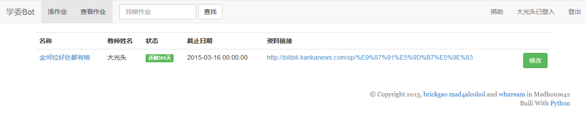
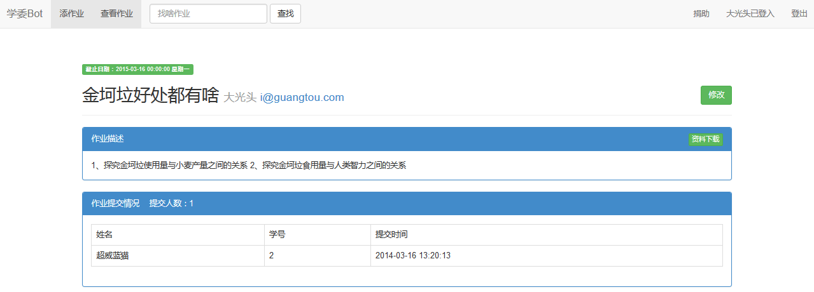
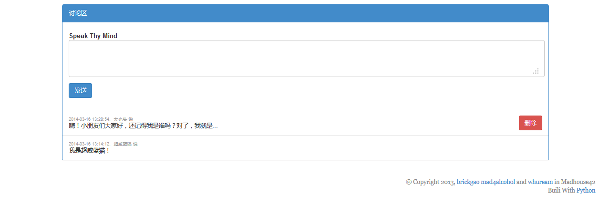
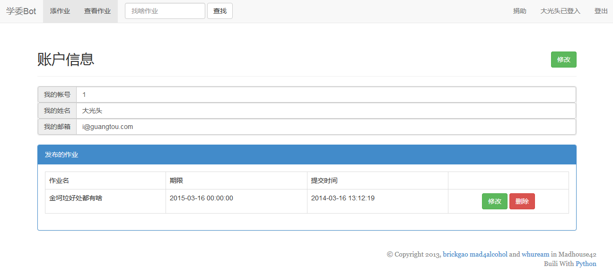
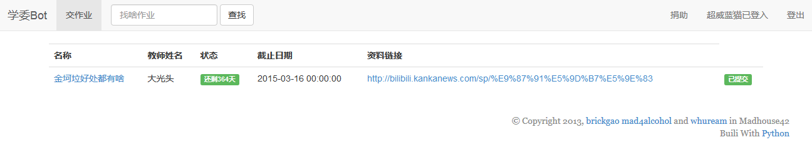
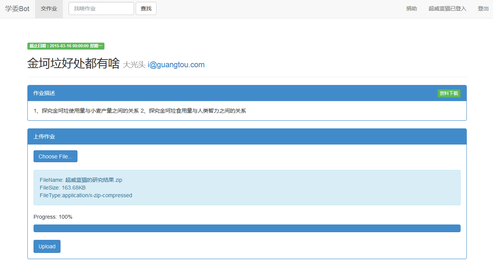
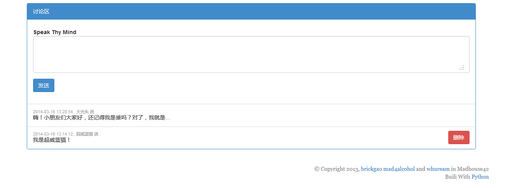
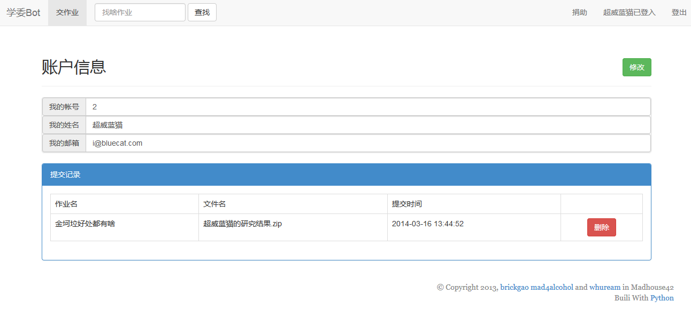

## InchoBot ##

InchoBot is a web bot helps teachers and assistants gathering students' homework (electronic version).

## Dependencies

*   python 2.7
*   flask
*   flask-sqlalchemy
*   flask-bootstrap

## Feathers

*   Teachers and assistants can assign homework.
*   Students can view, discuss and submit homework.
*   All files will be packaged and sent to teacher's email at the deadline.(TODO)

## Snapshot

*   

    ### Teacher `大光头`
    
    *   view assignments
        
        
    *   view assignment
        
        
        
    *   user profile
        
        
*   
    ### Student `超威蓝猫`
    
    *   view assignments
        
        
    *   view assignment
        
        
        
    *   user profile
        
    
    
    
    
    