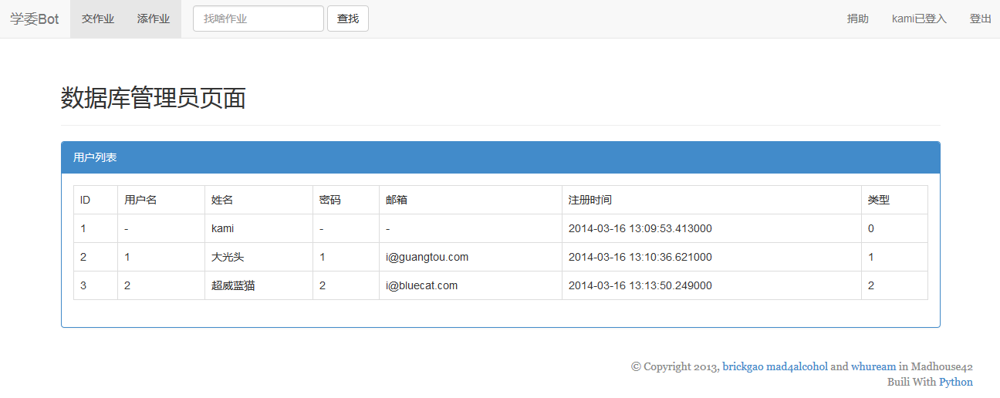

## InchoBot ##

InchoBot is a web app which targets in helping teachers and TAs gathering students' homework.

## Dependencies

*   python 2.7
*   flask
*   flask-sqlalchemy
*   flask-bootstrap

## Features

*   Teachers and TAs can make homework assignments.
*   Students can view, discuss and submit homework.
*   All files will be packaged and sent to teacher's email before the set deadline.(TODO)

## Usage

1. Change `app.config['SECRET_KEY'] = 'kami'` to `app.config['SECRET_KEY'] = 'YOUR_SECRET_KEY'` in `ibot/__init__.py`.
1. Change `kami = User('-', 'kami', '-', '-', datetime.datetime.today(), 0)` to `kami = User('ADMINISTRATOR_ID', 'ADMINISTRATOR_NAME', 'ADMINISTRATOR_PASS', 'ADMINISTRATOR_ENAMI', datetime.datetime.today(), 0)` in `db_init.py`.
1. Run `db_init.py` to initialize database.
1. Set `inchobot.app.run(debug=True)` in `main.py` for dev environment or set `inchobot.app.run(host='0.0.0.0')` for production environment.
1. Run `main.py` to start web server.

## Screenshots

*   

    ### Teacher `大光头`
    
    *   view assignments
        
        
    *   view assignment
        
        
        
    *   user profile
        
        
*   

    ### Student `超威蓝猫`
    
    *   view assignments
        
        
    *   view assignment
        
        
        
    *   user profile
        

*   

    ### Administrator `kami`
    
    
    
    
    
    
    
